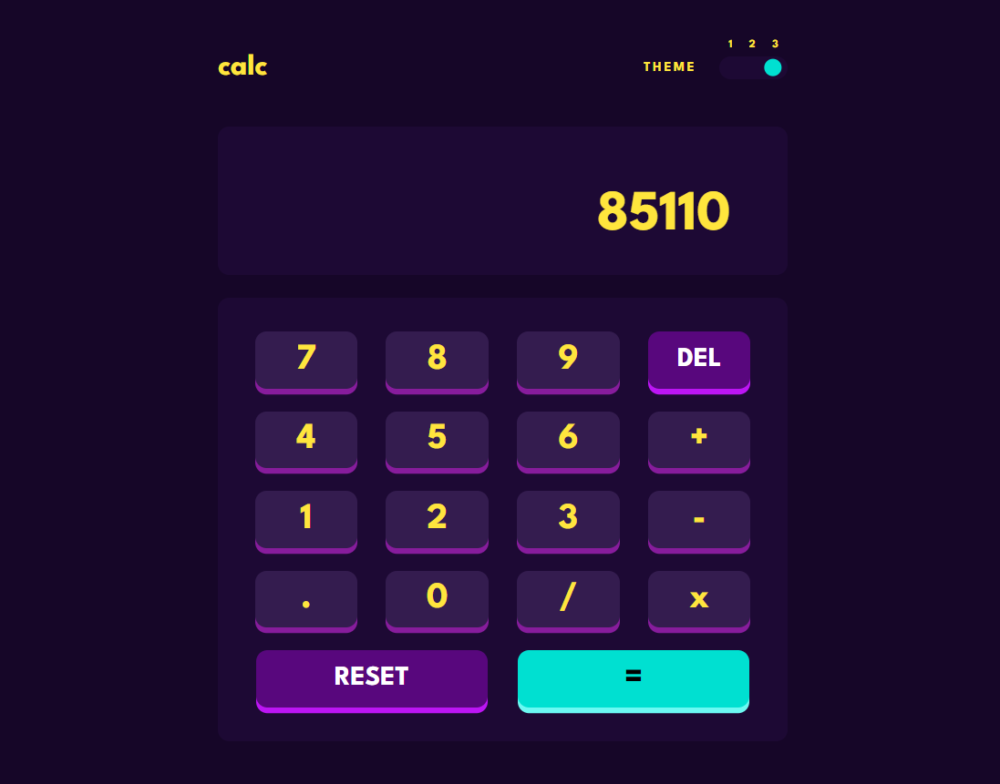

# Calculator App

---

## Description

It's basic calculator app with three different themes and ability to control with keyboard.\
I also added local storage, so when you leave or refresh this website your desired theme will be saved.\
I created this app to test my redux/typescript skills and I'm very happy with the results. \
App is available there: <a href="https://musikhood.github.io/Calculator/" target="_blank" >Link</a>

#### Technologies i used

- React
- Redux
- Typescript
- Sass
- BEM
- Webpack

---

## How To use with keyboard

#### Controls

Arrow (left & right) to switch the theme\
Numbers from 1 to 9, Operations & "." Dot\
Backspace to undo the last action\
Enter to get the result\
Delete to clear the calculator
